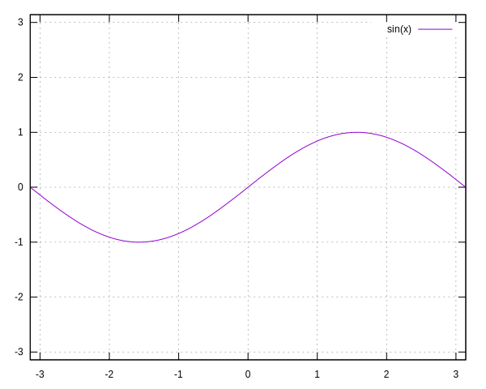
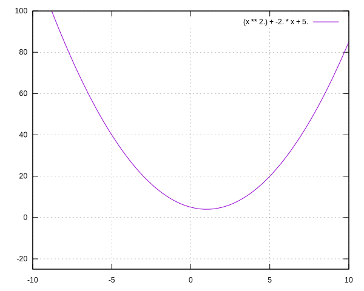

# Tutorial: Como desenhar curvas matemáticas em lua a partir da curvatura.

## Emanuel Bissiatti de Almeida

O tutorial foi testado no Ubuntu e também funciona no Windows com Ubuntu/WSL (no Windows 10 é preciso usar uma gambiara para abrir imagens pelo WSL com esse [tutorial](https://techcommunity.microsoft.com/t5/windows-dev-appconsult/running-wsl-gui-apps-on-windows-10/ba-p/1493242))

## Requisitos

Para esse tutorial é preciso instalar as seguintes linguagens e programas


* [Linguagem de programação brasileira Lua,](https://www.lua.org/)
* [GnuPlot para desenhar os gráficos das funções matemáticas,](http://www.gnuplot.info/)
* [luarocks um gerenciador de pacotes para lua.](https://luarocks.org/)

Baixe também as seguintes bibliotecas para lua nesta ordem:

* [ext.lua,](https://github.com/thenumbernine/lua-ext)
* [lua gnuplot,](https://github.com/thenumbernine/lua-gnuplot)
* [lua symmath.](https://github.com/thenumbernine/symmath-lua)

Para instalar as bibliotecas, após baixar os arquivos para uma pasta qualquer, descompacte cada biblioteca em uma pasta separada, vá para o diretório em que foi descompactado os arquivos e execute o comando:

```bash
luarocks make
```

Os códigos desse tutorial estarão disponíveis na pasta "./codigos"

## Hello World em Lua

Lua possuiu uma sintaxe simples e familiar principalmente para quem já conhece MatLab e Python. Veja alguns conceitos básicos:

### Comentários

```lua
-- Isso é um comentário em lua
```

### Print e Hello World

```lua
-- Veja um Hello World

print("Hello World")

-- Assim também é válido

print "Hello World"
```

### Tipos de dados

Em lua temos os seguintes tipos de dados primitivos, qualquer dúvida recomendo a consulta ao [manual oficial da linguagem,](https://www.lua.org/manual/5.1/pt/manual.html) disponível em português.

* 1	
nil

Usado para diferenciar o valor de ter alguns dados ou nenhum dado (nulo).

* 2	
boolean

Inclui verdadeiro e falso como valores. Geralmente usado para verificação de condições.

* 3	
number

Representa números reais (ponto flutuante de precisão dupla).

* 4	
string

Representa matriz de caracteres.

* 5	
function

Representa um método escrito em C ou Lua.

* 6	
userdata

Representa dados C arbitrários.

* 7	
thread

Representa threads de execução independentes e é usado para implementar co-rotinas.

* 8	
table

Representa matrizes comuns, tabelas de símbolos, conjuntos, registros, gráficos, árvores, etc., e implementa matrizes associativas. Ele pode conter qualquer valor (exceto nulo).

Fonte [ Manual de Referência de Lua 5.1](https://www.lua.org/manual/5.1/pt/manual.html)


### Definição de variáveis e funções

Em lua todas as definições inclusive dentro de funções são globais, inclusive se carregar o arquivo para outro código lua. Por isso recomenda-se definir as variáveis como locais.

```lua
-- Isso é uma variável global

a = 1

-- Isso é uma variável local

local b = 0

-- Funções também são definidas globalmente
function f(arg)
    return arg
end

-- Serão locais se definir como uma função local:

local function f2(arg)
    c = arg
end

-- Como c é global, posso imprimir o valor de c após executar a função.

f2(10)

print(c)
```

### Condições

Similar ao matlab, temos a seguinte estrutura condicional em lua:

```lua
local x = true
if x then
    print("essa expressão é verdadeira")
    print("\n")
end

-- Em lua utilizamos as palavras especiais 'and', 'or' e 'not' para trabalhar com operadores lógicos

local y = -1

if not x then
    print("Essa mensagem não vai aparecer")
elseif x and y >0
    print("X é verdadeiro, mas como y<0, isso aqui nunca vai acontecer")
else
    print("Essa mensagem é esperada, tudo acima é falso.")
end

```

### Tables e for em tables

As tabelas são uma estrutura de dados muito útil em lua, capaz de armazenar qualquer tipo de dados em uma estrutura que lembra um dicionário python, porém com algumas propriedades a mais com a capacidade de trabalhar como um vetor.

```lua

-- Para definir uma table utiliza "{}"
local myTable = {a,b,c}

-- Atente que em lua começamos a contar os elementos de uma table a partir do 1

print(myTable[1]) -- imprime a

-- Caso um índice de uma table não possuiu um elemento, vai retornar nil

print(myTable[0]) -- imprime nil


-- Podemos adicionar e modificar elementos passando um índice e o valor desejado

myTable[1] = 10

-- É possível utilizar tanto índices inteiros como strings:

myTable["t1"] = 1

-- Se preferir use:

myTable.t2 = 2

-- O índice inteiro não precisa coincidir com o números de elementos da tabela

myTable[7] = 77

-- O interpretador vai automaticamente preencher os valores entre os índices que estão vazios com nil


-- Para fazer um for sobre o vetor use:

for key, value in pairs(myTable) do
    print(key,value)
end

```

Saída:

```bash 
1       10
2       b
3       c
7       77
t2      2
t1      1
```
Também é possível iterar apenas pelos indices numéricos, como se fosse uma lista.
```lua
for index, value in pairs(myTable) do
    print(index,value)
end
```

Entretanto, esse método termina no primeiro índice nulo, o 7 índice não foi iterado, veja:

```bash 
1       10
2       b
3       c
```

### Iteradores

Já vimos como iterar sobre uma table, veja outras formas de iterações conhecidas:


```lua
-- No for, primeiro determina a variável de iteração com o seu valor final,
-- em seguida o valor final e por fim o valor que será acrescentado a cada iteração.
for i=0,3,0.5 do
    print(i)
end
```
Veja a saída
```bash
0.0
0.5
1.0
1.5
2.0
2.5
3.0
```
```lua
-- O While segue a mesma lógica de outras linguagens, veja a sintaxe.
while true do
    -- Para evitar um loop infinito
    if true then
        break
    end
end
```

Com essas informações iniciais sobre a linguagem lua, já é possível entender tudo o que farei nesse tutorial.

## Symmath Gnuplot para curvas.

Antes de utilizar as bibliotecas para o desenvolvimento de curvas, é importante comentar algumas funções que nos serão úteis. 

Symmath é uma biblioteca desenvolvida originalmente para física computacional, implementando funções e manipulações algébricas em lua. Essa biblioteca é muito versátil: ela é capaz transformar as funções matemáticas em funções computacionais escritas em lua, funções como uma string, uma fórmula escrita em LaTex ou exportar como uma função de plot do GnuPlot.

### Importando as Bibliotecas:

```lua
-- Importando a biblioteca symmath
require('symmath')
-- Importando a bibliotecas mas adicionando as variáveis da biblioteca como globais
require('symmath').setup()

-- Carregando a biblioteca para usar o gnuplot de terminal com lua
local gnuplot = require('gnuplot')

-- No caso acima, eu renomeie a biblioteca, como o "as" do python
```
### Funções de matemática simbólica

O código seguinte, está disponível na pasta "./codigos/calculo.lua". Esse código são algumas operações úteis para trabalhar com matemática simbólica voltado para curvas.

```lua
require('symmath').setup()

-- Definição das variáveis simbólicas

local t,x,y,alpha,beta = vars("t","x","y","\\alpha","\\beta")

-- Definindo uma função simbólica
local f = alpha*sin(x)

print("Função f:")
print(f)

-- Definindo a derivada

local df = f:diff(x)

print("\nDefinindo a derivada:")
print(df)

-- Derivando

df = df()

print("Derivada calculada de f")
print(df)

-- Calculando a integral indefinida da função

local F = f:integrate(x)()

print("\nIntegral indefinifa de f")
print(F)

-- Calulando a integral definida da função no intervalo 0 a t

local integral = f:integrate(x,0,t)()

print("integral definifa de f de 0 a t:")
print(integral)

-- Definindo um vetor:

print("\nTrabalhando com vetores:")
local v = Array(4,3)
print("v=")
print(v)

-- Calculo da norma 2 de um vetor:

print("Norma do Vetor v:")

print(v:norm())

-- Criando uma matriz a partir de dois vetores
local u = Array(x,y)

local M = Matrix(v,u)

print("Matriz:")
print(M)
-- Perceba que os vetores são passados como as linhas da matriz e não como colunas

-- Matriz transposta

print("Matriz transposta:")

Mt = M:T()
print(M)

print("Calculo do determinante da Matriz transposta:")

print(Mt:determinant())
```
Saida esperada no terminal
```
Função f:
\alpha * sin(x)

Definindo a derivada:
  ∂                  
╶──╴(\alpha * sin(x))
 ∂x                  
Derivada calculada de f
\alpha * cos(x)

Integral indefinifa de f
 - \alpha * cos(x)
integral definifa de f de 0 a t:
\alpha * (1 - cos(t))

Trabalhando com vetores:
v=
┌ ┐
│4│
│ │
│3│
└ ┘
Norma do Vetor v:
5
Matriz:
┌    ┐
│4  3│
│    │
│x  y│
└    ┘
Matriz transposta:
┌    ┐
│4  3│
│    │
│x  y│
└    ┘
Calculo do determinante da Matriz transposta:
 - 3 * x + 4 * y
```


### Exportando as expressões simbólicas.

É interessante não só construir calcular expressões simbólicas em uma linguagem de programação, mas também, é útil exportar essas funções para a linguagem, para um documento LaTex ou o gráfico da função como uma imagem. Veja o código do arquivo "codigos/exportar.lua"

```lua
require('symmath').setup()
local x,t = vars("x","t")

-- Definindo uma função qualquer
local f = x*sin(x)+x

print("Função f como expressão simbólica:")
print(f)
-- Exportando a função para LaTex

local fLatex = symmath.export.LaTeX(f)

print("\nfunção f exportada para LaTex:")

print(fLatex)

-- Exportar para uma função em lua:

-- Para exportar é preciso passar um table com as variáveis
local funcLua, code = f:compile({x})

print("\nImprimido o código da função traduzido para a linguagem lua:")
print(code)

print("Imprimido alguns valores da função")

print("x=0","f(x)="..funcLua(0),"x=pi/2","f(x)="..funcLua(math.pi/2),"x=pi","f(x)="..funcLua(math.pi))
```
Saida esperada:

```
Função f como expressão simbólica:
x * sin(x) + x

função f exportada para LaTex:
${{{x}} {{\sin\left(  x\right)}}} + {x}$

Imprimido o código da função traduzido para a linguagem lua:
return function (x)
        local out1 = x + x * math.sin(x)
        return out1
end
Imprimido alguns valores da função
x=0     f(x)=0.0        x=pi/2  f(x)=3.1415926535898    x=pi    f(x)=3.1415926535898
```
### Gráficos de funções com GnuPlot.

A biblioteca gnuplot é resumidamente uma função para chamar o gnuplot de terminal dentro do lua. Então, tudo que o gnuplot faz é possível fazer com essa biblioteca, veja alguns exemplos:

```lua
require('symmath').setup()
local gnuplot = require 'gnuplot'

local x,y = vars("x","y")

-- Plot de uma função em R^2
local plotStr = {
    "set term svg", -- Define o tipo de imagem como svg (por padrão é png)
    "set grid", -- Imagem com grade
    "set xrange [-pi:pi]", -- Define o intervalo de x
    "set yrange [-pi:pi]", -- Define o itervalo de y
    output="imgs/plotStr.svg", -- Define o arquivo de saida
    {"sin(x)"} -- Table com a função que queremos imprimir em string
}

-- Para gerar o gráfico basta passar para o gnuplot a table com os parâmetros de plot
gnuplot(plotStr)


local g = x^2-2*x+5

print(g)

-- Para transformar em uma string para o GnuPlot basta exportar como tal
g = symmath.export.GnuPlot(g)

print(g)

local plotSymmath = {
    "set term svg", -- Define o tipo de imagem como svg (por padrão é png)
    "set grid", -- Imagem com grade
    "set xrange [-10:10]", -- Define o intervalo de x
    "set yrange [-25:100]", -- Define o itervalo de y
    output="imgs/plotSymmath.svg", -- Define o arquivo de saida
    {g} -- Table com a função esper
}

gnuplot(plotSymmath)
```

Da saida do terminal temos:

```
 2            
x  - 2 * x + 5
(x ** 2.) + -2. * x + 5.
```

Já as imagens exportadas das funções são:





## Trabalhando com curvas em $R^2$

