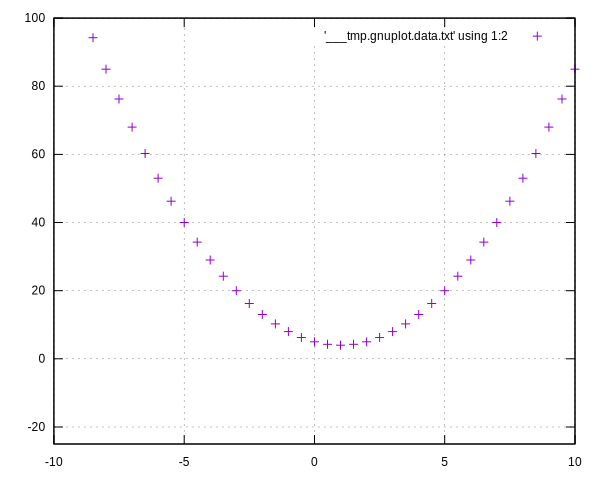
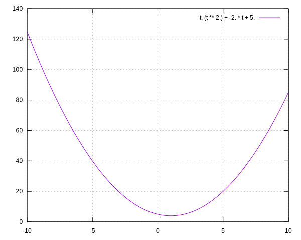
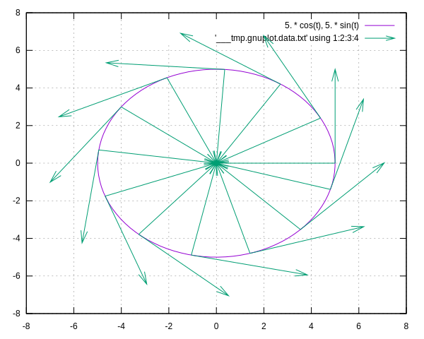
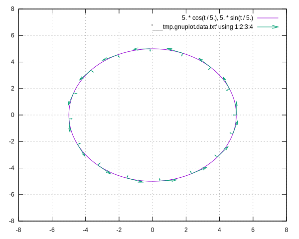
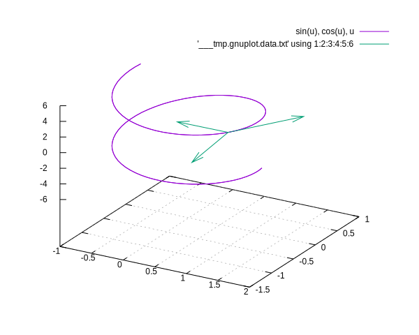

# Tutorial: Como desenhar curvas matemáticas em lua a partir da curvatura.

## Emanuel Bissiatti de Almeida

O tutorial foi testado no Ubuntu e também funciona no Windows com Ubuntu/WSL (no Windows 10 é preciso usar uma gambiara para abrir imagens pelo WSL com esse [tutorial](https://techcommunity.microsoft.com/t5/windows-dev-appconsult/running-wsl-gui-apps-on-windows-10/ba-p/1493242))

## Requisitos

Para esse tutorial é preciso instalar as seguintes linguagens e programas


* [Linguagem de programação brasileira Lua,](https://www.lua.org/)
* [GnuPlot para desenhar os gráficos das funções matemáticas,](http://www.gnuplot.info/)
* [luarocks um gerenciador de pacotes para lua.](https://luarocks.org/)

Baixe também as seguintes bibliotecas para lua nesta ordem:

* [ext.lua,](https://github.com/thenumbernine/lua-ext)
* [lua gnuplot,](https://github.com/thenumbernine/lua-gnuplot)
* [lua symmath.](https://github.com/thenumbernine/symmath-lua)

Para instalar as bibliotecas, após baixar os arquivos para uma pasta qualquer, descompacte cada biblioteca em uma pasta separada, vá para o diretório em que foi descompactado os arquivos e execute o comando:

```bash
luarocks make
```

Os códigos desse tutorial estarão disponíveis na pasta "./codigos"

## Hello World em Lua

Lua possuiu uma sintaxe simples e familiar principalmente para quem já conhece MatLab e Python. Veja alguns conceitos básicos:

### Comentários

```lua
-- Isso é um comentário em lua
```

### Print e Hello World

```lua
-- Veja um Hello World

print("Hello World")

-- Assim também é válido

print "Hello World"
```

### Tipos de dados

Em lua temos os seguintes tipos de dados primitivos, qualquer dúvida recomendo a consulta ao [manual oficial da linguagem,](https://www.lua.org/manual/5.1/pt/manual.html) disponível em português.

* 1	
nil

Usado para diferenciar o valor de ter alguns dados ou nenhum dado (nulo).

* 2	
boolean

Inclui verdadeiro e falso como valores. Geralmente usado para verificação de condições.

* 3	
number

Representa números reais (ponto flutuante de precisão dupla).

* 4	
string

Representa matriz de caracteres.

* 5	
function

Representa um método escrito em C ou Lua.

* 6	
userdata

Representa dados C arbitrários.

* 7	
thread

Representa threads de execução independentes e é usado para implementar co-rotinas.

* 8	
table

Representa matrizes comuns, tabelas de símbolos, conjuntos, registros, gráficos, árvores, etc., e implementa matrizes associativas. Ele pode conter qualquer valor (exceto nulo).

Fonte [ Manual de Referência de Lua 5.1](https://www.lua.org/manual/5.1/pt/manual.html)


### Definição de variáveis e funções

Em lua todas as definições inclusive dentro de funções são globais, inclusive se carregar o arquivo para outro código lua. Por isso recomenda-se definir as variáveis como locais.

```lua
-- Isso é uma variável global

a = 1

-- Isso é uma variável local

local b = 0

-- Funções também são definidas globalmente
function f(arg)
    return arg
end

-- Serão locais se definir como uma função local:

local function f2(arg)
    c = arg
end

-- Como c é global, posso imprimir o valor de c após executar a função.

f2(10)

print(c)
```

### Condições

Similar ao matlab, temos a seguinte estrutura condicional em lua:

```lua
local x = true
if x then
    print("essa expressão é verdadeira")
    print("\n")
end

-- Em lua utilizamos as palavras especiais 'and', 'or' e 'not' para trabalhar com operadores lógicos

local y = -1

if not x then
    print("Essa mensagem não vai aparecer")
elseif x and y >0
    print("X é verdadeiro, mas como y<0, isso aqui nunca vai acontecer")
else
    print("Essa mensagem é esperada, tudo acima é falso.")
end

```

### Tables e for em tables

As tabelas são uma estrutura de dados muito útil em lua, capaz de armazenar qualquer tipo de dados em uma estrutura que lembra um dicionário python, porém com algumas propriedades a mais com a capacidade de trabalhar como um vetor.

```lua

-- Para definir uma table utiliza "{}"
local myTable = {a,b,c}

-- Atente que em lua começamos a contar os elementos de uma table a partir do 1

print(myTable[1]) -- imprime a

-- Caso um índice de uma table não possuiu um elemento, vai retornar nil

print(myTable[0]) -- imprime nil


-- Podemos adicionar e modificar elementos passando um índice e o valor desejado

myTable[1] = 10

-- É possível utilizar tanto índices inteiros como strings:

myTable["t1"] = 1

-- Se preferir use:

myTable.t2 = 2

-- O índice inteiro não precisa coincidir com o números de elementos da tabela

myTable[7] = 77

-- O interpretador vai automaticamente preencher os valores entre os índices que estão vazios com nil


-- Para fazer um for sobre o vetor use:

for key, value in pairs(myTable) do
    print(key,value)
end

```

Saída:

```bash 
1       10
2       b
3       c
7       77
t2      2
t1      1
```
Também é possível iterar apenas pelos indices numéricos, como se fosse uma lista.
```lua
for index, value in pairs(myTable) do
    print(index,value)
end
```

Entretanto, esse método termina no primeiro índice nulo, o 7 índice não foi iterado, veja:

```bash 
1       10
2       b
3       c
```

### Iteradores

Já vimos como iterar sobre uma table, veja outras formas de iterações conhecidas:


```lua
-- No for, primeiro determina a variável de iteração com o seu valor final,
-- em seguida o valor final e por fim o valor que será acrescentado a cada iteração.
for i=0,3,0.5 do
    print(i)
end
```
Veja a saída
```bash
0.0
0.5
1.0
1.5
2.0
2.5
3.0
```
```lua
-- O While segue a mesma lógica de outras linguagens, veja a sintaxe.
while true do
    -- Para evitar um loop infinito
    if true then
        break
    end
end
```

Com essas informações iniciais sobre a linguagem lua, já é possível entender tudo o que farei nesse tutorial.

## Symmath Gnuplot para curvas.

Antes de utilizar as bibliotecas para o desenvolvimento de curvas, é importante comentar algumas funções que nos serão úteis. 

Symmath é uma biblioteca desenvolvida originalmente para física computacional, implementando funções e manipulações algébricas em lua. Essa biblioteca é muito versátil: ela é capaz transformar as funções matemáticas em funções computacionais escritas em lua, funções como uma string, uma fórmula escrita em LaTex ou exportar como uma função de plot do GnuPlot.

### Importando as Bibliotecas:

```lua
-- Importando a biblioteca symmath
require('symmath')
-- Importando a bibliotecas mas adicionando as variáveis da biblioteca como globais
require('symmath').setup()

-- Carregando a biblioteca para usar o gnuplot de terminal com lua
local gnuplot = require('gnuplot')

-- No caso acima, eu renomeie a biblioteca, como o "as" do python
```
### Funções de matemática simbólica

O código seguinte, está disponível na pasta "./codigos/calculo.lua". Esse código são algumas operações úteis para trabalhar com matemática simbólica voltado para curvas.

```lua
require('symmath').setup()

-- Definição das variáveis simbólicas

local t,x,y,alpha,beta = vars("t","x","y","\\alpha","\\beta")

-- Definindo uma função simbólica
local f = alpha*sin(x)

print("Função f:")
print(f)

-- Definindo a derivada

local df = f:diff(x)

print("\nDefinindo a derivada:")
print(df)

-- Derivando

df = df()

print("Derivada calculada de f")
print(df)

-- Calculando a integral indefinida da função

local F = f:integrate(x)()

print("\nIntegral indefinifa de f")
print(F)

-- Calulando a integral definida da função no intervalo 0 a t

local integral = f:integrate(x,0,t)()

print("integral definifa de f de 0 a t:")
print(integral)

-- Definindo um vetor:

print("\nTrabalhando com vetores:")
local v = Array(4,3)
print("v=")
print(v)

-- Calculo da norma 2 de um vetor:

print("Norma do Vetor v:")

print(v:norm())

-- Criando uma matriz a partir de dois vetores
local u = Array(x,y)

local M = Matrix(v,u)

print("Matriz:")
print(M)
-- Perceba que os vetores são passados como as linhas da matriz e não como colunas

-- Matriz transposta

print("Matriz transposta:")

Mt = M:T()
print(M)

print("Calculo do determinante da Matriz transposta:")

print(Mt:determinant())
```
Saida esperada no terminal
```
Função f:
\alpha * sin(x)

Definindo a derivada:
  ∂                  
╶──╴(\alpha * sin(x))
 ∂x                  
Derivada calculada de f
\alpha * cos(x)

Integral indefinifa de f
 - \alpha * cos(x)
integral definifa de f de 0 a t:
\alpha * (1 - cos(t))

Trabalhando com vetores:
v=
┌ ┐
│4│
│ │
│3│
└ ┘
Norma do Vetor v:
5
Matriz:
┌    ┐
│4  3│
│    │
│x  y│
└    ┘
Matriz transposta:
┌    ┐
│4  3│
│    │
│x  y│
└    ┘
Calculo do determinante da Matriz transposta:
 - 3 * x + 4 * y
```


### Exportando as expressões simbólicas.

É interessante não só construir calcular expressões simbólicas em uma linguagem de programação, mas também, é útil exportar essas funções para a linguagem, para um documento LaTex ou o gráfico da função como uma imagem. Veja o código do arquivo "codigos/exportar.lua"

```lua
require('symmath').setup()
local x,t = vars("x","t")

-- Definindo uma função qualquer
local f = x*sin(x)+x

print("Função f como expressão simbólica:")
print(f)
-- Exportando a função para LaTex

local fLatex = symmath.export.LaTeX(f)

print("\nfunção f exportada para LaTex:")

print(fLatex)

-- Exportar para uma função em lua:

-- Para exportar é preciso passar um table com as variáveis
local funcLua, code = f:compile({x})

print("\nImprimido o código da função traduzido para a linguagem lua:")
print(code)

print("Imprimido alguns valores da função")

print("x=0","f(x)="..funcLua(0),"x=pi/2","f(x)="..funcLua(math.pi/2),"x=pi","f(x)="..funcLua(math.pi))
```
Saida esperada:

```
Função f como expressão simbólica:
x * sin(x) + x

função f exportada para LaTex:
${{{x}} {{\sin\left(  x\right)}}} + {x}$

Imprimido o código da função traduzido para a linguagem lua:
return function (x)
        local out1 = x + x * math.sin(x)
        return out1
end
Imprimido alguns valores da função
x=0     f(x)=0.0        x=pi/2  f(x)=3.1415926535898    x=pi    f(x)=3.1415926535898
```
### Gráficos de funções com GnuPlot.

A biblioteca gnuplot é resumidamente uma função para chamar o gnuplot de terminal dentro do lua. Então, tudo que o gnuplot faz é possível fazer com essa biblioteca, veja alguns exemplos:

```lua
require('symmath').setup()
local gnuplot = require 'gnuplot'

local x,y = vars("x","y")

-- Plot de uma função em R^2
local plotStr = {
    "set term svg", -- Define o tipo de imagem como svg (por padrão é png)
    "set grid", -- Imagem com grade
    "set xrange [-pi:pi]", -- Define o intervalo de x
    "set yrange [-pi:pi]", -- Define o itervalo de y
    output="imgs/plotStr.svg", -- Define o arquivo de saida
    {"sin(x)"} -- Table com a função que queremos imprimir em string
}

-- Para gerar o gráfico basta passar para o gnuplot a table com os parâmetros de plot
gnuplot(plotStr)


local g = x^2-2*x+5

print(g)

-- Para transformar em uma string para o GnuPlot basta exportar como tal
local gplot = symmath.export.GnuPlot(g)

print(gplot)

local plotSymmath = {
    "set term svg", -- Define o tipo de imagem como svg (por padrão é png)
    "set grid", -- Imagem com grade
    "set xrange [-10:10]", -- Define o intervalo de x
    "set yrange [-25:100]", -- Define o itervalo de y
    output="imgs/plotSymmath.svg", -- Define o arquivo de saida
    {gplot} -- Table com a função para plot
}

gnuplot(plotSymmath)

-- Agora vamos desenhar alguns pontos usando gnuplot e a função em symmath

-- Primeiro transformar a função simbólica em função lua

local glua = g:compile({x})

-- Em seguida criar duas tables para armazenar as coordenadas dos pontos

local xpoints, ypoints = {}, {}

-- Agora vamos iterar para gerar pontos xs e seu respectivo valor em g(x)
for i = -10, 10, 0.5 do
    table.insert(xpoints,i) -- inserindo o valor de x_i
    table.insert(ypoints,glua(i)) -- inserindo o valor de y_i
end

-- Imprimindo do console um ponto de exemplo
print("x="..xpoints[1],"y="..ypoints[1])

-- Unindo os dados em uma única tabela

local points = {xpoints,ypoints}

-- Imprimindo os pontos com gnuplot

local toPlot = {
    "set term svg", -- Define o tipo de imagem como svg (por padrão é png)
    "set grid", -- Imagem com grade
    "set xrange [-10:10]", -- Define o intervalo de x
    "set yrange [-25:100]", -- Define o itervalo de y
    output="imgs/points.svg", -- Define o arquivo de saida
	data = points, -- Table com os dados 
	{using = '1:2'}, -- Define o que cada coluna dos dados representa
}
gnuplot(toPlot)


```

Da saida do terminal temos:

```
 2            
x  - 2 * x + 5
(x ** 2.) + -2. * x + 5.
x=-10.0 y=125.0
```

Já as imagens exportadas das funções são:


E os pontos da função quadrática.



## Trabalhando com curvas paramétricas em $R^2$

Nos exemplos acima exemplifiquei as ferramentas com plots de funções matemáticas. Agora, vamos estudar curvas paramétricas em $R^2$ e como representá-las no ambiente computacional.

<b>Definição 1:</b> Uma curva parametrizada em $R^n$ é uma aplicação $\delta: I \to R^n$ sendo $I \subset R$

Por padrão, o GnuPlot trabalha com a variável t para o plot de uma curva parametrizada. Sendo assim, vamos trabalhar com a variável t para parametrizadas as curvas.


Então, no plano cartesiano em $R^2$ vamos trabalhar com a representação da curva como:

$\alpha(t)=\begin{matrix}[x(t) && y(t) \end{matrix}]$

Por exemplo, uma parametrização da parábola $y=x^2-2x+5$ é: $\alpha(t)=\begin{matrix}[t && t^2-2t+5 \end{matrix}]$

Observe no arquivo ".\codigos\parabola.lua" como parametrizar a parabola.

```lua
require('symmath').setup()
local gnuplot = require 'gnuplot'

-- Definição da variável
local t = vars("t")

-- Definição da curva parametrizada.
-- Vamos tratar a curva como um vetor bidmensional alpha(t) = [x(t),y(t)]
local alpha = Array(t,t^2-2*t+5)

print(alpha)

-- Transformando para plot
local alphaPlot = symmath.export.GnuPlot(alpha)

print(alphaPlot)

-- Infelizmente, o export contém "{}" do vetor que o gnuplot não compreende, então vamos remove-los da string.

alphaPlot = string.sub(alphaPlot,2,#alphaPlot-1)

print(alphaPlot)

-- Traço da curva:

gnuplot({
    "set term svg", -- Define que a imagem exportada será uma 
    "set grid",
    "set parametric", -- Define o tipo de função como paramétrica
    "set trange [-10:10]", -- Define o intervalo de t.
    output="imgs/parabola.svg", -- Define o output
    {alphaPlot},
})
```
Saida esperada do terminal

```
┌              ┐
│       t      │
│              │
│ 2            │
│t  - 2 * t + 5│
└              ┘
{t, (t ** 2.) + -2. * t + 5.}
t, (t ** 2.) + -2. * t + 5.
```
Veja o traço da curva:



Agora vamos aprender um pouco mais sobre curvas:

<b>Definição 2:</b> Vetor tangente.

Seja $\alpha: I \to R^n$, tal que $\alpha(t)=(\alpha_1(t),\alpha_2(t),...,\alpha_n(t))$ com cada $\alpha(t)_i$ diferenciáveis, o vetor $\alpha(t)'=(\alpha_1'(t),\alpha_2'(t),...,\alpha_n'(t))$ é chamado de vetor tangente (também conhecido como vetor velocidade).


<b>Definição 3:</b> Curva regular.

Seja $\alpha(t):= I \to R^n$ uma curva parametrizada e diferenciável, se $\alpha'(t) \ne 0$, $\forall t \in I$ então a curva $\alpha(t)$ é dita regular.

<b>Definição 3:</b> Comprimento de arco.

O comprimento da curva diferenciável $\alpha(t):= I \to R^n$  entre os pontos $a$ e $b$ é matematicamente definido por:

$\int _a ^b ||\alpha'(t)||dt$

<b>Definição 4:</b> Unit Speed.

Seja $\alpha(t): I \to R^n$ uma curva regular diferenciável. Se a norma do vetor velocidade: $||\alpha(t)'||=1$, então a curva possuiu velocidade unitária

<b>Definição 5:</b> Reparametrização.

Uma curva $\beta(t)$ é dita uma reparametrização de $\alpha(t): I \to R^n$ quando dados $I_0$ e quando $\phi(s): I \to I_0$ é um difeomorfismo ($\phi(s)$ é derivável e bijetiva com $\phi(s)^{-1}$ sendo derivável).

<b>Teorema:</b> Reparametrização por comprimento de arco.

Seja $\alpha(t): I \to R^n$ uma curva regular diferenciável e seja $\phi(t)$ a função comprimento de arco $\phi(t)=\int _{t_0} ^t ||\alpha'(t)||dt$. Então, $\alpha(t)$ pode ser reparametrizada como $\beta(s)=\alpha(\phi(t))$ tal que $||\beta(s)'||=1$.

No arquivo "codigos\curvaFuncoes.lua" implementei uma função para calcular o comprimento de arco e para reparametrizar por comprimento de arco. Veja:

```lua
require('symmath').setup()

-- Função que calcula o comprimento de arco
-- Recebe curva c regular diferenciável, variável var, intervalo inicial a, intervalo final b
-- Retorna o comprimento de arco no intervalo definido [a,b] ou a integral indefinida em função de t
function ComprimentoDeArco(c,var,a,b)
    -- var, a, b são opcionais, caso o usuário não passe (valor = nil) substituo por:
    a = a or true
    b = b or true
    local t = var or symmath.vars("t")

    -- Calcula a norma do vetor tangente de c
    local u = c:diff(t)():norm()

    -- Calcula o comprimento de arco através da integral da norma do vetor tangente
    if a or b then
        u = u:integrate(t)();
    else
        u = u:integrate(t,a,b)()
    end
    return u
end

-- Função de reparametrização de uma curva c
-- Recebe curva c regular diferenciável, e a variável var
-- Retorna a nova curva c só que reparametrizada por comprimento de arco
function Reparametrizacao(c,var)
    -- var, é opcional, caso o usuario não passe (valor = nil) substitue por t:
    local t = var or vars("t")
    local y = vars('y')
    -- Calcula o comprimento de arco e faz o replace de t em função de y
    local eqn = symmath.op.eq(ComprimentoDeArco(c,var), y)
    -- Encontra a inversa de y
    local sol =  symmath.solve(eqn, t)[2]
    -- Substituiu t pelo valor parametrizado por comprimento de arco.
    sol = symmath.replace(sol,y,t)
    return symmath.replace(c, t, sol)
end
```
Agora, vamos estudar a taxa de variação da tangente de uma curva através da curvatura.

<b>Definição 5:</b> Curvatura sem sinal para curvas unit speed.

Seja $\alpha(t): I \to R^n$ uma curva regular duas vezes diferenciável em unit-speed. Sua curvatura $k(t)$ é definida como:

$k(t)=|\alpha''(t)|$

<b>Teorema:</b> Curvatura com sinal para qualquer curva regular em $R^2$.

Seja $\alpha(t): I \to R^2$ uma curva regular. Se $\alpha(t)$ é duas vezes diferenciável, então sua curvatura é definida por: 

$k(t)=\dfrac{det([\alpha'(t),\alpha''(t)])}{||\alpha'(t)||^3}$

Veja a função curvatura no caso geral em $R^2$ usando symmath.

```lua
-- Função curvatura, calcula a curvatura (em R^2) de uma curva c em função de t.
-- Recebe curva c regular duas vezes diferenciável, e a variável var
-- Retorna sua curvatura com sinal.
function CurvaturaR2(c,var)
    -- Verifica se a dimensão da curva é 2.
    if c:dim()[1] ~= 2 then
        error("The dimension of curve c is not 2")
    end
    -- var, é opcional, caso o usuario não passe (valor = nil) substitue por t:
    local var = var or vars("t")
    -- dif1 é a primeira derivada da curva, vetor velocidade
    local dif1 = c:diff(var)()
    -- dif2 é a segunda derivada da curva, vetor aceleração
    local dif2 = dif1:diff(var)()
    -- u é a norma do vetor velocidade
    local u = dif1:norm()

    -- retorna a função curvatura de c. 
    return ((dif1[1]*dif2[2])-(dif1[2]*dif2[1]))/(u)^3
end
```
Em $R^2$ sabemos que qualquer curva pode ser definida a partir de sua curvatura e de um ponto inicial, como afirma o Teorema Fundamental (local) das Curvas Planas.

<b>Definição:</b> Movimento Rígido:

Seja $F:R^n\to R^n$ uma aplicação. Se $F$ preserva distância, isto é, $||x−y||=||F(x)−F(y)||$, $\forall x,y \in R^n$ então $F$ é um movimento rígido.

<b>Teorema:</b> Teorema Fundamental (Local) das Curvas Planas.

Seja $k(t)$ a curvatura de uma curva plana $\alpha(t)$. Então $\alpha(t)$ pode ser definida por $k(t)$ a um movimento rígido.

Se $\theta(s)=\int k(t)dt$. 

Logo, $\alpha(t)=\int[cos(\theta(t)),sin(\theta(s))]dt$

Veja como encontrar a curva dada a curvatura em $R^2$ com lua:

```lua
-- Função para obter uma curva a um movimento rígido a partir da curvatura.
-- Receve a curvatura e a variável var.
-- Retorna a curva
function CurvaDeCurvaturaR2(curvatura,var)
    -- var, é opcional, caso o usuario não passe (valor = nil) substitue por t:
    local var = var or vars('t')

    -- Encontra a função Theta
    local theta = symmath.Integral(curvatura,var)()
    -- Encontra o vetor tangente a um movimento rígdo
    local cdiff = Array(cos(theta),sin(theta))

    -- Retorna a curva
    return cdiff:integrate(var)()
end
```

### Exemplos em $R^2$

Após definir as funções, veja a aplicação dessas funções em algumas curvas no plano.

* Circulo não unit-speed:

    $c(t)=\left[ \begin{matrix} {{5}} {{\cos\left(  t\right)}} && {{5}} {{\sin\left(  t\right)}}\end{matrix} \right]$
    
    

    Com comprimento de arco de: ${{5}} {{t}}$

    Vamos reparametrizar por comprimento de arco com a função 

    $c2(t)=\left[ \begin{matrix} {{5}} {{\cos\left( {{\frac{1}{5}} {t}}\right)}} && {{5}} {{\sin\left( {{\frac{1}{5}} {t}}\right)}}\end{matrix} \right]$
    
     

    ```lua
    local gnuplot = require 'gnuplot'
    require('symmath').setup()

    require("curvaFuncoes")

    local t = vars("t")

    local e = Array(5*cos(t),5*sin(t))

    -- Exportando para latex
    -- print(symmath.export.LaTeX(e))
    -- print(symmath.export.LaTeX(ComprimentoDeArco(e)))

    -- e2 é a curva reparametrizada
    local e2 = Reparametrizacao(e)

    -- print(symmath.export.LaTeX(e2))

    local ePlot = Array2GnuPlotR2(e)
    local ePlot2 = Array2GnuPlotR2(e2)

    -- Criando vetores alpha'(t) e alpha''(t) 
    local x0,y0,x1,y1={},{},{},{}
    local ed = e:diff(t)()
    local edd = ed:diff(t)()
    local eFunc = e:compile({t})
    ed = ed:compile({t})
    edd = edd:compile({t})


    for i = 0, 6.30, 0.5 do
        local p0 = eFunc(i)
        table.insert(x0,p0[1])
        table.insert(y0,p0[2])
        local p1 = ed(i)
        table.insert(x1,p1[1])
        table.insert(y1,p1[2])
        
        table.insert(x0,p0[1])
        table.insert(y0,p0[2])
        local p2 = edd(i)
        table.insert(x1,p2[1])
        table.insert(y1,p2[2])

    end

    local toPlot = {
        --persist = true,
        "set term svg",
        "set grid",
        "set parametric",
        "set trange [-pi:pi]",
        "set xrange [-8:8]",
        "set yrange [-8:8]",
        output="imgs/curva1.svg",
        {ePlot},
        style = 'data vector',
        data = {
            x0,
            y0,
            x1,
            y1,
        },
        {using = '1:2:3:4'},
    }

    gnuplot(toPlot)

    -- Criando vetores alpha'(t) e alpha''(t) 
    x0,y0,x1,y1={},{},{},{}

    local ed2 = e2:diff(t)()
    local edd2 = ed2:diff(t)()
    local eFunc2 = e2:compile({t})
    ed2 =  ed2:compile({t})
    edd2 = edd2:compile({t})


    for i = 0, 2*math.pi*5, 2 do
        local p0 = eFunc2(i)
        table.insert(x0,p0[1])
        table.insert(y0,p0[2])
        local p1 = ed2(i)
        table.insert(x1,p1[1])
        table.insert(y1,p1[2])
        
        table.insert(x0,p0[1])
        table.insert(y0,p0[2])
        local p2 = edd2(i)
        table.insert(x1,p2[1])
        table.insert(y1,p2[2])
    end


    local toPlot = {
        --persist = true,
        "set term svg",
        "set grid",
        "set parametric",
        "set trange [-pi*5:pi*5]",
        "set xrange [-8:8]",
        "set yrange [-8:8]",
        output="imgs/curva2.svg",
        {ePlot2},
        style = 'data vector',
        data = {
            x0,
            y0,
            x1,
            y1,
        },
        {using = '1:2:3:4'},
    }

    gnuplot(toPlot)
    ```

### Trabalhando com curvas paramétricas em $R^3$

A maior parte do que foi definido sobre as curvas no $R^2$ é válido para as curvas em $R^3$, mas se tratando de uma dimensão a mais, temos que a curvatura não é suficiente para descrever a curva no espaço, surgindo assim uma nova característica, a torção.

Se $\alpha(t): I \to R^3$ é uma curva duas vezes diferenciável, regular e unit speed sua curvatura corresponde ao $||\alpha(t)''||$, caso não seja regular, sua curvatura será:

<b>Teorema:</b> Curvatura sem sinal para qualquer curva regular em $R^3$:

Se $\alpha(t): I \to R^3$ é uma curva duas vezes diferenciável e regular, sua curvatura pode ser calculada como:

$k(t)=\dfrac{||\alpha'(t)\times \alpha''(t)||}{||\alpha(t)'||^3}$

A torção ($\tau$) é uma propriedade que mede o quanto uma curva se projeta para fora do plano de curvatura em $R^3$, uma curva pode aproximar-se ou afastar-se do vetor normal.

<b>Definição:</b> Torção para uma curva regular em $R^3$:

Se $\alpha(t): I \to R^3$ é uma curva três vezes diferenciável e regular, então sua torção é definida como:

$\tau(t)=\dfrac{(\alpha'(t)\times \alpha''(t)) \cdot \alpha'''(t)}{||\alpha'(t)\times \alpha''(t)||^2}$

<b>Definição:</b> Triedro de Frenet para uma curva 2-regular em $R^3$:

Se $\alpha(t): I \to R^3$ é uma curva três vezes diferenciável, 2-regular e parametrizada por comprimento de arco, então o Triedro de Frenet, uma base ortogonal no ponto $P \in \alpha(t)$ é definida como:

$T(t) = \alpha(t)'$

$N(t) = \dfrac{\alpha''(t)}{||\alpha''(t)||}$

$B(t) = T(t)\times N(t)$

Portanto o Triedro de Frenet em $t$ é = $[T(t),N(t),B(t)]$

### Exemplos em $R^2$:

Observe a espiral $\alpha(t)=\left[ \begin{matrix} \sin\left(  u\right) &&& \cos\left(  u\right) && u\end{matrix} \right]$

Possuiu curvatura: 

$\dfrac{\sqrt{2}}{{\sqrt{2}}^{3}} = \dfrac{1}{\sqrt(2)}$

E torção: 

$\dfrac{{{-{\cos\left(  u\right)}}{{\cos\left(  u\right)}}} + { {-{\sin\left(  u\right)}} {{\sin\left(  u\right)}}} + {0}}{{\sqrt{2}}^{2}}=\dfrac{-1}{2}$

Veja a curva e o Triedro de Frenet em um ponto.

 

A seguir o código que calculou essas informações, (disponível em "codigos/exemplosR3.lua")

```lua
local gnuplot = require 'gnuplot'
require('symmath').setup()
require("curvaFuncoes")

local u = var("u")
local f = Array(sin(u),cos(u),u)

local triedro = TriedroFrenet(f,u)

-- Obter informações da curva no terminal
print(f)
print(CurvaturaR3(f,u))
print(TorcaoR3(f,u))
print(triedro)
-- Obter saida em LaTex
-- print(symmath.export.LaTeX(f))
-- print(symmath.export.LaTeX(CurvaturaR3(f,u)))
-- print(symmath.export.LaTeX(TorcaoR3(f,u)))

-- criar o triedo em um ponto

local t0 = 2
local funcF,code1 = f:compile({u})
local funcTriedo,code2 = triedro:compile({u})

-- print(code1)
-- print(code2)

local p0Triedo = funcTriedo(t0)
local p0 = funcF(t0)
x0 = {p0[1],p0[1],p0[1]}
y0 = {p0[2],p0[2],p0[2]}
z0 = {p0[3],p0[3],p0[3]}

x1 = {p0Triedo[1][1],p0Triedo[1][2],p0Triedo[1][3]}
y1 = {p0Triedo[2][1],p0Triedo[2][2],p0Triedo[1][3]}
z1 = {p0Triedo[3][1],p0Triedo[3][2],p0Triedo[3][3]}

-- Exportar traço da curva como svg
local exp = Array2GnuPlotR3(f)
local toPlot = {
	--persist = true,
    "set term svg",
    "set grid",
    "set parametric",
    output="imgs/3d.svg",
    {splot=true,exp},
    style = 'data vector',
	data = {
		x0,
		y0,
        z0,
		x1,
		y1,
        z1,
	},
	{splot=true,using = '1:2:3:4:5:6'},
}
gnuplot(toPlot)
```

